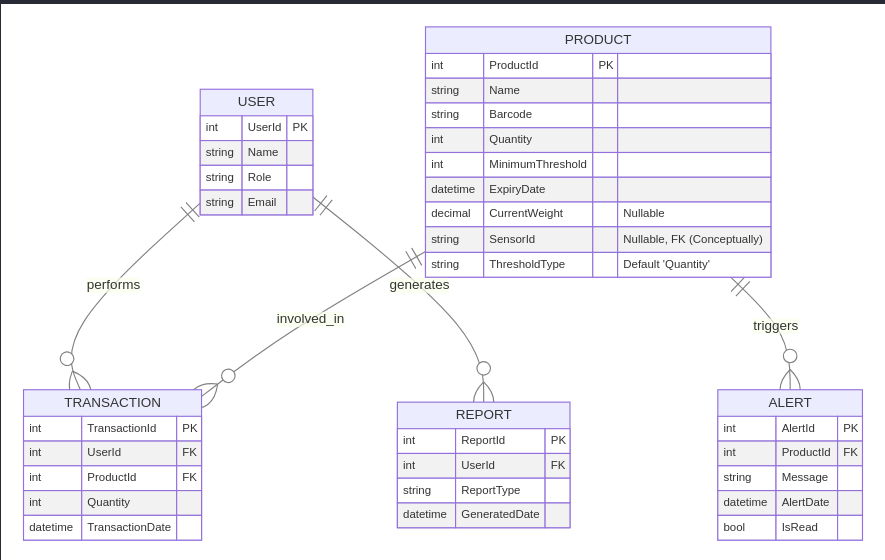
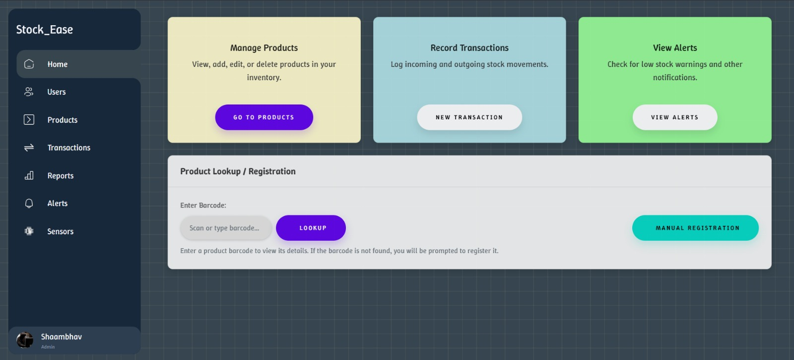
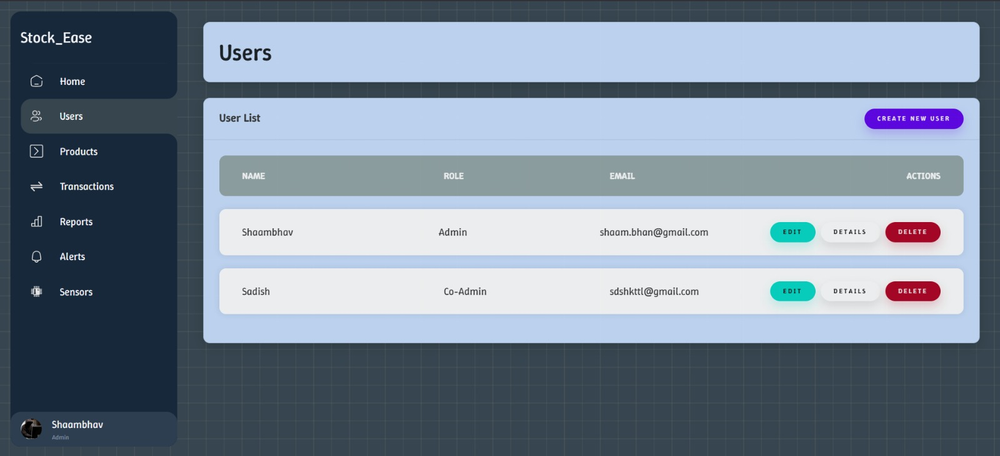
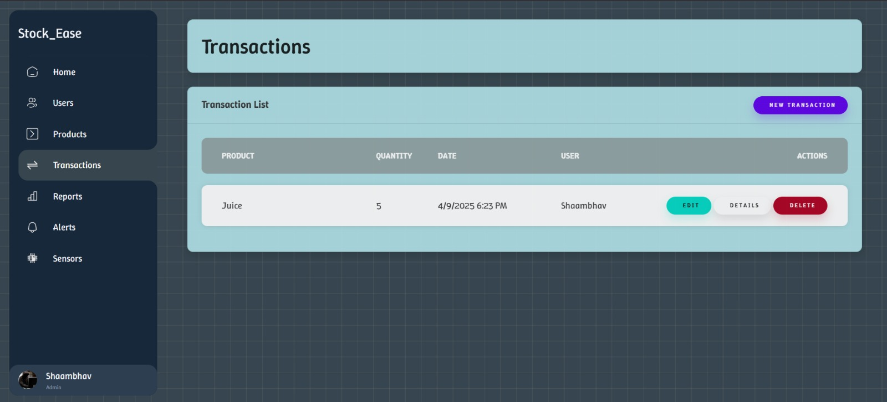
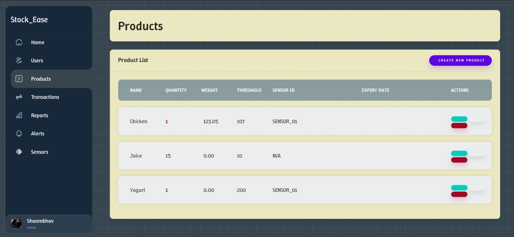
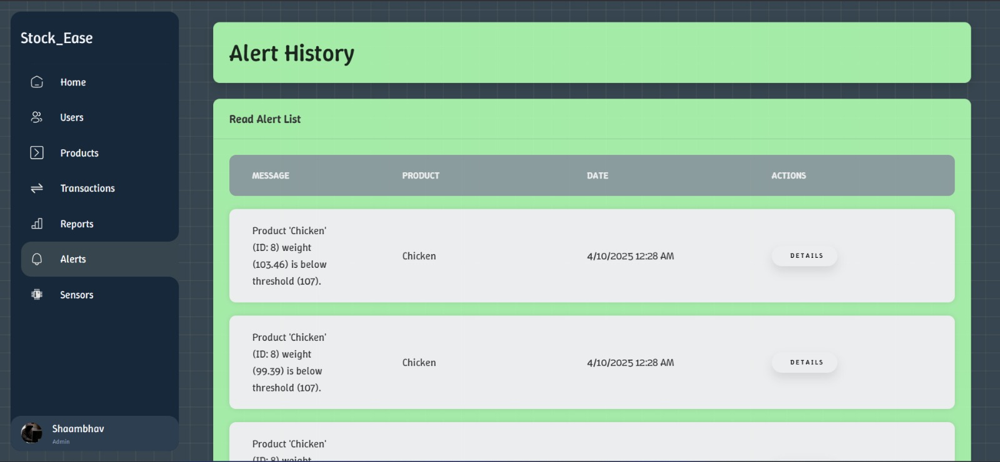

# 📦 Stock_Ease Inventory Management System

Stock_Ease is a web-based inventory management system designed to track products, manage stock levels, monitor inventory health through alerts, and integrate with simulated weight sensors for real-time updates.

## ✨ Features

- **Product Management:** Maintain a catalog of products including details like name, barcode, quantity/weight tracking, minimum stock thresholds, expiry dates, and associated sensor IDs. Full CRUD (Create, Read, Update, Delete) operations are supported.
- **Transaction Tracking:** Record manual stock adjustments (incoming/outgoing) associated with specific users and products.
- **User Management:** Basic user tracking with roles.
- **Alerting System:**
  - Automatically generates alerts when product levels (quantity or weight) fall below predefined thresholds.
  - Includes logic for restocking periods to prevent alert fatigue.
  - Distinguishes between unread (active) and read (historical) alerts.
  - Provides an alert history view.
- **Weight Sensor Integration:**
  - Tracks product levels based on data received from simulated external weight sensors via a dedicated API endpoint (`/api/weightintegration/screendata`).
  - Supports configuring products for either quantity-based or weight-based tracking.
  - Displays the last known weight reported by sensors.
- **Real-time UI Updates:** Utilizes SignalR to provide immediate visual feedback on the product list page when weight sensor data is updated, without requiring a page refresh.
- **Reporting:** Basic structure for generating inventory reports.
- **Sensor Monitoring:** Displays the status of connected sensors.

## 💻 Technology Stack

- **Core Framework:** ASP.NET Core 8 MVC
- **Language:** C# 12
- **Database:** Microsoft SQL Server
- **Object-Relational Mapper (ORM):** Entity Framework Core 8
- **Frontend:** Razor Views (CSHTML), HTML5, CSS3, Bootstrap 5, JavaScript
- **Real-time Communication:** ASP.NET Core SignalR
- **Testing:** MSTest (Unit Testing), T-SQL (Database Integrity Checks)
- **Development Environment:** Visual Studio 2022+, .NET 8 SDK

## 🏗️ Architecture

The application follows the Model-View-Controller (MVC) architectural pattern, promoting separation of concerns. It leverages ASP.NET Core's built-in Dependency Injection (DI) container for managing services like the `DbContext`, SignalR `HubContext`, and custom services (`WeightSensorStatusService`).

- **Models:** Define domain entities (`Product`, `User`, etc.) and the `DbContext` for EF Core interactions.
- **Views:** Razor views (`.cshtml`) render the user interface using HTML, CSS, and JavaScript.
- **Controllers:** Handle HTTP requests, interact with models and services, and select views to render.
- **Services:** Encapsulate specific business logic (e.g., `WeightSensorStatusService` for managing sensor state and restocking timers).

## 💾 Database Schema



_(Note: The `SensorId` in `Product` conceptually links to an external sensor system.)_

## 🚀 Setup & Running

1.  **Prerequisites:**

    - [.NET 8 SDK](https://dotnet.microsoft.com/download/dotnet/8.0) or later.
    - Microsoft SQL Server (Express, Developer, or Standard edition). Ensure the server instance is running.
    - (Optional) [Python 3](https://www.python.org/downloads/) for running the sensor simulation script.

2.  **Clone the Repository:**

    ```bash
    git clone https://github.com/knull-reaper/stock-ease
    cd Stock_Ease
    ```

3.  **Configure Database Connection:**

    - Open the `Stock_Ease/appsettings.json` file.
    - Locate the `ConnectionStrings` section:
      ```json
      "ConnectionStrings": {
          "Stock_EaseContext": "Data Source=Cr33p3r;Initial Catalog=stock_ease;Integrated Security=True;Encrypt=False;Trust Server Certificate=True"
      }
      ```
    - The current connection string uses **Integrated Security (Windows Authentication)** to connect to the SQL Server instance named `Cr33p3r` and the database `stock_ease`.
    - **If this configuration works for your environment, you can skip this step.**
    - Otherwise, update the `Data Source` (server name/instance), `Initial Catalog` (database name), and authentication details (e.g., switch to SQL Server authentication with `User ID` and `Password` if needed) to match your SQL Server setup.

4.  **Apply Database Migrations:**

    - Open a terminal or command prompt in the `Stock_Ease` directory (the one containing `Stock_Ease.csproj`).
    - Run the following command to create the database and apply the schema:
      ```bash
      dotnet ef database update --project Stock_Ease/Stock_Ease.csproj
      ```
    - _(Note: If you don't have the EF Core tools installed, run `dotnet tool install --global dotnet-ef` first.)_

5.  **Run the Application:**

    - You can run the application using the .NET CLI:
      ```bash
      dotnet run --project Stock_Ease/Stock_Ease.csproj
      ```
    - Alternatively, open the `Stock_Ease.sln` file in Visual Studio and press F5 or click the "Start Debugging" button.
    - The application should be accessible at the URLs specified in `Stock_Ease/Properties/launchSettings.json` (typically `https://localhost:xxxx` and `http://localhost:yyyy`).

6.  **(Optional) Run Sensor Simulation:**
    - Navigate to the `Stock_Ease/external_scripts` directory.
    - Ensure the API URL in `ocr_sender.py` matches the running application's URL (if different from the default).
    - Run the script:
      ```bash
      python ocr_sender.py
      ```
    - This will start sending simulated weight data to the application's API endpoint, triggering real-time updates if configured.

## 📸 Screenshots






