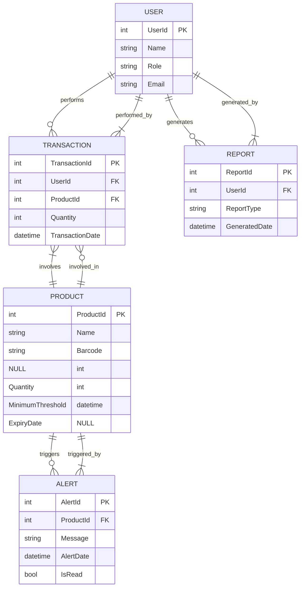

# PROG1322 Detailed Project Report: Stock_Ease Inventory Management System

**Group Members:** [Please Add Group Member Names Here]
**Date:** April 8, 2025

---

## Table of Contents

1.  [🎯 Project Overview & Alignment with Course Outcomes](#1--project-overview--alignment-with-course-outcomes)
    *   [1.1. Project Background, Domain Choice, and Scope](#11-project-background-domain-choice-and-scope)
    *   [1.2. Alignment with Learning Outcomes](#12-alignment-with-learning-outcomes-)
2.  [💾 Database Design and Implementation Journey](#2--database-design-and-implementation-journey)
    *   [2.1. Choosing the Path: Code First with EF Core](#21-choosing-the-path-code-first-with-ef-core)
    *   [2.2. Entity Relationship Model (ERM)](#22-entity-relationship-model-erm)
    *   [2.3. Conceptual Schema Diagram](#23-conceptual-schema-diagram)
    *   [2.4. Data Integrity Mechanisms](#24-data-integrity-mechanisms)
3.  [🏗️ Application Architecture](#3--application-architecture)
    *   [3.1. Technology Stack](#31-technology-stack)
    *   [3.2. Architectural Pattern: Model-View-Controller (MVC)](#32-architectural-pattern-model-view-controller-mvc)
    *   [3.3. Dependency Injection (DI)](#33-dependency-injection-di)
    *   [3.4. Request Lifecycle (Simplified)](#34-request-lifecycle-simplified)
4.  [⚙️ Building the Application: Functionality and Implementation Story](#4--building-the-application-functionality-and-implementation-story)
    *   [4.1. Managing Products (`ProductsController`, `Views/Products/`)](#41-managing-products-productscontroller-viewsproducts)
    *   [4.2. Recording Transactions (`TransactionsController`, `Views/Transactions/`)](#42-recording-transactions-transactionscontroller-viewstransactions)
    *   [4.3. User, Alert, and Report Management](#43-user-alert-and-report-management)
    *   [4.4. Data Access with LINQ & EF Core](#44-data-access-with-linq--ef-core)
5.  [🧪 Testing Strategy and Implementation](#5--testing-strategy-and-implementation)
    *   [5.1. Database Testing (T-SQL)](#51-database-testing-t-sql)
    *   [5.2. Application Unit Testing (C# / MSTest)](#52-application-unit-testing-c--mstest)
6.  [🤔 Design Choices and Considerations](#6--design-choices-and-considerations)
7.  [🏁 Conclusion](#7--conclusion)
8.  [👥 Peer Evaluation & Contribution Report](#8--peer-evaluation--contribution-report)

---

## 1. 🎯 Project Overview & Alignment with Course Outcomes

**1.1. Project Background, Domain Choice, and Scope:**

> This project, "Stock\_Ease," was undertaken to fulfill the requirements of the PROG1322 course assignment. The primary objective was to design, develop, test, and document a robust, data-driven web application, thereby demonstrating a practical understanding of the core software engineering principles and technologies covered in the course.

The chosen domain for this project is **Inventory Management**. This domain was selected for several reasons:
*   **Practical Relevance:** Inventory management is a fundamental challenge faced by businesses of all sizes, making the project relatable and demonstrating the application of learned skills to solve real-world problems.
*   **Technical Requirements Alignment:** It naturally lends itself to implementing core database concepts (tables, relationships), full CRUD (Create, Read, Update, Delete) operations, data validation, and potentially more advanced features like reporting and real-time notifications.
*   **Scalability Demonstration:** While implemented as a local application for this assignment, the underlying principles are applicable to larger, enterprise-level inventory systems.

**Stock\_Ease** is designed as a foundational inventory management system suitable for small businesses or individual use. Its core purpose is to provide a centralized platform to:
*   **Track Products:** Maintain a catalog of products, including details like name, barcode, current quantity on hand, minimum desired stock level (threshold), and expiry dates where applicable.
*   **Manage Stock Levels:** Record incoming stock (purchases, returns) and outgoing stock (sales, disposals) through transactions.
*   **Monitor Inventory Health:** Automatically generate alerts when product quantities fall below predefined minimum thresholds.
*   **User Accountability:** Associate transactions and reports with specific users (though full authentication/authorization is outside the current scope).
*   **Basic Reporting:** Provide a mechanism to generate simple inventory reports (the current implementation is basic and could be expanded).

The application aims to replace manual tracking methods (like spreadsheets or paper logs), reducing errors, improving efficiency, and providing better visibility into inventory status.

**1.2. Alignment with Learning Outcomes:** ✅

> This project meticulously addresses the specified PROG1322 course learning outcomes:

*   **LO1: Design and Create a Distributed Database Application:**
    *   ✅ Designed and implemented a relational database schema using Microsoft SQL Server with appropriate tables, keys, and relationships.
    *   ✅ Utilized Entity Framework Core (Code First) for programmatic schema definition and management.
    *   *(See Section 2 for details)*

*   **LO2: Implement Automated Testing (TDD):**
    *   ✅ Developed T-SQL scripts for database-level data integrity validation.
    *   ✅ Implemented C# Unit Tests (MSTest) with mocking (Moq) and isolation (In-Memory DB) for application logic, demonstrating TDD concepts.
    *   *(See Section 5 for details)*

*   **LO3: Develop an Integrated Data-Driven Web Application:**
    *   ✅ Built upon ASP.NET Core 8 MVC, integrating with SQL Server.
    *   ✅ Leveraged EF Core 8 and LINQ extensively for data access.
    *   ✅ Developed a functional CRUD web interface using Razor Views.
    *   ✅ Adhered to a multi-layer design via the MVC pattern.
    *   *(See Sections 3 & 4 for details)*

*   **LO4: Present and Document Your Work:**
    *   ✅ This comprehensive written report serves as the primary documentation deliverable.

---

## 2. 💾 Database Design and Implementation Journey

**2.1. Choosing the Path: Code First with EF Core**

> We decided to embark on the database design using the **Code First** approach with Entity Framework Core. This felt like the most natural fit for developing a new application within Visual Studio, allowing us to define our inventory world using C# classes first and then letting EF Core translate that into a database schema.

*   **Why Code First?** 💡
    *   It kept our focus on the application's domain model (`Product`, `User`, etc.) defined in C#.
    *   Having the model classes version-controlled alongside our application code was a significant advantage.
    *   EF Core Migrations promised a structured way to evolve the database as our understanding of the requirements grew.

*   **Our Workflow in Visual Studio:** ⚙️
    1.  **Modeling the Domain:** We started by creating the initial POCO classes (like `Product`, `User`) in the `Models` folder, defining their properties within the Visual Studio editor.
        `[SCREENSHOT HERE: Code snippet of Product.cs or User.cs model definition]`
    2.  **Setting up the Context:** Next, we configured the `Stock_EaseContext` (`Data/stock_ease_context.cs`), adding `DbSet<T>` properties to tell EF Core which classes should become database tables.
        `[SCREENSHOT HERE: Code snippet of Stock_EaseContext.cs showing DbSets]`
    3.  **Generating the First Migration:** Using the **Package Manager Console** (PMC) in Visual Studio (found under Tools > NuGet Package Manager), we ran our first `Add-Migration InitialCreate`. This command analyzed our models and generated the C# code for the migration script, outlining the SQL needed to create the initial tables. *Challenge:* ⚠️ Sometimes, we had to manually adjust the generated migration if EF Core didn't infer constraints exactly as intended, or if we forgot a property initially.
        `[SCREENSHOT HERE: Package Manager Console showing 'Add-Migration InitialCreate' command execution]`
        `[SCREENSHOT HERE: Code snippet of the generated InitialCreate migration file]`
    4.  **Creating the Database:** With the migration ready, we executed `Update-Database` in the PMC. This command ran the migration script against our local SQL Server instance, bringing our database schema to life. Visual Studio's integration made this relatively straightforward. *Challenge:* ⚠️ Ensuring the connection string in `appsettings.json` was correct and that the SQL Server instance was running was crucial here; incorrect settings led to runtime errors initially.
        `[SCREENSHOT HERE: Package Manager Console showing 'Update-Database' command execution]`

*   **Reflection:** 💭 While Code First worked well, we recognized the importance of carefully planning migrations, especially in a team setting, to avoid conflicts. For projects connecting to complex, pre-existing databases, Database First might have been a more suitable approach.

**2.2. Entity Relationship Model (ERM):**

The database schema consists of the following core entities and their relationships:

*   **User:** Represents individuals interacting with the system.
    *   `UserId` (PK, int, Identity)
    *   `Name` (nvarchar(max), NOT NULL)
    *   `Role` (nvarchar(max), NOT NULL) - *Could be enhanced with a separate Role table.*
    *   `Email` (nvarchar(max), NOT NULL) - *Could have a UNIQUE constraint.*
    *   *Relationships:*
        *   One User **can perform** multiple Transactions (One-to-Many with `Transaction`).
        *   One User **can generate** multiple Reports (One-to-Many with `Report`).

*   **Product:** Represents the items being tracked in inventory.
    *   `ProductId` (PK, int, Identity)
    *   `Name` (nvarchar(max), NOT NULL)
    *   `Barcode` (nvarchar(max), NULL) - Optional field for barcode scanning integration.
    *   `Quantity` (int, NOT NULL) - Current stock level.
    *   `MinimumThreshold` (int, NOT NULL, Default: 0) - The level at which a low-stock alert should be triggered.
    *   `ExpiryDate` (datetime2, NULL) - Optional field for perishable goods.
    *   *Relationships:*
        *   One Product **can be involved in** multiple Transactions (One-to-Many with `Transaction`).
        *   One Product **can trigger** multiple Alerts (One-to-Many with `Alert`).

*   **Transaction:** Records every change in a product's stock quantity.
    *   `TransactionId` (PK, int, Identity)
    *   `UserId` (FK, int, NOT NULL) - References `User.UserId`. Indicates who performed the transaction.
    *   `ProductId` (FK, int, NOT NULL) - References `Product.ProductId`. Indicates which product was affected.
    *   `Quantity` (int, NOT NULL) - The change in quantity. Positive values indicate stock increase (e.g., purchase), negative values indicate stock decrease (e.g., sale). *Improvement: Add a `TransactionType` (e.g., "Purchase", "Sale", "Adjustment") field for clarity instead of relying solely on the sign of Quantity.*
    *   `TransactionDate` (datetime2, NOT NULL) - Timestamp of the transaction.
    *   *Relationships:*
        *   Many Transactions **are performed by** one User (Many-to-One with `User`).
        *   Many Transactions **involve** one Product (Many-to-One with `Product`).

*   **Report:** Represents generated inventory reports (currently a basic structure).
    *   `ReportId` (PK, int, Identity)
    *   `UserId` (FK, int, NOT NULL) - References `User.UserId`. Indicates who generated the report.
    *   `ReportType` (nvarchar(max), NOT NULL) - Type of report (e.g., "Low Stock", "Full Inventory").
    *   `GeneratedDate` (datetime2, NOT NULL) - Timestamp of report generation.
    *   *Relationships:*
        *   Many Reports **are generated by** one User (Many-to-One with `User`).

*   **Alert:** Represents system notifications, primarily for low stock levels.
    *   `AlertId` (PK, int, Identity)
    *   `ProductId` (FK, int, NOT NULL) - References `Product.ProductId`. Indicates which product triggered the alert.
    *   `Message` (nvarchar(max), NOT NULL) - The alert message content.
    *   `AlertDate` (datetime2, NOT NULL) - Timestamp when the alert was generated.
    *   `IsRead` (bit, NOT NULL) - Flag indicating if the alert has been acknowledged/read by a user.
    *   *Relationships:*
        *   Many Alerts **can be triggered by** one Product (Many-to-One with `Product`).

**2.3. Conceptual Schema Diagram:**


`[SCREENSHOT HERE: SQL Server Object Explorer in Visual Studio or SSMS showing the created tables and their columns/keys]`

**2.4. Data Integrity Mechanisms:**

Data integrity is maintained through a combination of database and application-level strategies:

*   **Database Level:**
    *   **Primary Keys (PK):** Uniquely identify each record in a table (e.g., `ProductId` in `Products`). Enforced by SQL Server.
    *   **Foreign Keys (FK):** Ensure referential integrity between related tables (e.g., a `Transaction` must relate to an existing `Product` and `User`). Enforced by SQL Server based on EF Core configuration.
    *   **Data Types:** SQL Server enforces data types defined by EF Core migrations (e.g., preventing text insertion into an `int` column).
    *   **Nullability:** Constraints prevent NULL values in columns defined as non-nullable in the C# models (e.g., `Product.Name`).
    *   **T-SQL Checks:** Custom scripts (`SqlTests/CheckProductConstraints.sql`) provide additional business rule validation (e.g., quantity >= 0).
*   **Application Level:**
    *   **Model Validation:** ASP.NET Core MVC's model binding and validation system (`ModelState.IsValid` in controllers) checks for required fields and potentially data annotations (like `[Required]`, `[StringLength]`, etc., though minimally used in current models). Example: `ProductsController` explicitly checks for non-empty `Name`.
    *   **Business Logic:** Controller actions contain logic that implicitly validates data before saving (e.g., calculating stock levels before deciding to create an alert).

---

## 3. 🏗️ Application Architecture

**3.1. Technology Stack:**

*   **Core Framework:** ASP.NET Core 8 MVC
*   **Language:** C# 12
*   **Database:** Microsoft SQL Server
*   **Object-Relational Mapper (ORM):** Entity Framework Core 8
*   **Frontend:** Razor Views, HTML5, CSS3, Bootstrap 5 (default template), JavaScript (minimal custom)
*   **Real-time Communication:** ASP.NET Core SignalR (basic hub implemented)
*   **Testing Frameworks:** MSTest (Unit Testing), Moq (Mocking), T-SQL (Database Testing)
*   **Development Environment:** Microsoft Visual Studio 2022 (or later) with the ASP.NET and web development workload, .NET 8 SDK, SQL Server Management Studio (optional)

**3.2. Architectural Pattern: Model-View-Controller (MVC)**

> Stock_Ease is built using the well-established **Model-View-Controller (MVC)** architectural pattern. This pattern promotes separation of concerns, making the application more organized, maintainable, and testable.

*   **Model:** Represents the application's data and business logic.
    *   **Domain Models:** POCO classes in `Models/DomainModels.cs` (e.g., `Product`, `User`) define the structure of the data.
    *   **Data Access:** The `Stock_EaseContext` class (`Data/stock_ease_context.cs`) acts as the primary gateway to the database, utilizing EF Core to map domain models to database tables and execute queries.
    *   **Business Logic:** While some logic resides in controllers currently, in a larger application, this might be encapsulated in separate service classes.

*   **View:** Responsible for presenting the data to the user and rendering the user interface.
    *   Located in the `Views/` directory, organized by controller (e.g., `Views/Products/`).
    *   Uses **Razor syntax** (`.cshtml` files) to combine HTML markup with C# code to dynamically generate HTML responses.
    *   Includes shared layout elements (`Views/Shared/_Layout.cshtml`, `_Sidebar.cshtml`) for consistent UI structure.
    *   Leverages CSS (e.g., `wwwroot/css/site.css`, Bootstrap) for styling and JavaScript (`wwwroot/js/site.js`) for client-side interactivity.

*   **Controller:** Acts as the intermediary between the Model and the View.
    *   Located in the `Controllers/` directory (e.g., `ProductsController.cs`).
    *   Receives HTTP requests from the client (browser).
    *   Interprets user input (route data, query strings, form data).
    *   Interacts with the Model (via the `DbContext`) to retrieve or update data using LINQ and EF Core methods.
    *   Selects the appropriate View to render and passes necessary data (view models) to it.
    *   Returns an HTTP response (typically HTML rendered by the View) to the client.

**3.3. Dependency Injection (DI):**

> ASP.NET Core has built-in support for Dependency Injection, which is utilized in Stock_Ease:

*   **Service Registration:** In `Program.cs`, services like the `Stock_EaseContext` are registered with the DI container.
    ```csharp
    // Example from Program.cs (conceptual)
    builder.Services.AddDbContext<Stock_EaseContext>(options =>
        options.UseSqlServer(builder.Configuration.GetConnectionString("Stock_EaseContext")));
    builder.Services.AddScoped<AlertsController>(); // Registering controllers if needed for injection
    builder.Services.AddControllersWithViews();
    ```
*   **Constructor Injection:** Controllers receive their dependencies (like the `DbContext` or other controllers/services) through their constructors. ASP.NET Core automatically provides instances from the DI container.
    ```csharp
    // From ProductsController.cs
    public class ProductsController(Stock_EaseContext context, AlertsController alertsController) : Controller
    {
        private readonly Stock_EaseContext _context = context; // Injected DbContext
        private readonly AlertsController _alertsController = alertsController; // Injected Controller
        // ...
    }
    ```
*   **Benefits:** DI promotes loose coupling, making components easier to test (by injecting mocks) and maintain.

**3.4. Request Lifecycle (Simplified):**

1.  User navigates to a URL (e.g., `/Products/Edit/5`).
2.  ASP.NET Core Routing middleware maps the URL to the `Edit` action on the `ProductsController`, extracting the `id` parameter (5).
3.  The DI container creates an instance of `ProductsController`, injecting its dependencies (`Stock_EaseContext`, `AlertsController`).
4.  The `Edit` action method executes.
5.  It uses the injected `_context` to query the database for the Product with ID 5 (`_context.Products.FindAsync(id)`).
6.  If found, the controller creates a View Model (in this case, the `Product` object itself) and passes it to the `View()` method.
7.  The Razor View Engine locates the corresponding view (`Views/Products/Edit.cshtml`).
8.  The view executes, rendering HTML using the provided model data.
9.  The controller returns the rendered HTML as an HTTP response to the user's browser.

---

## 4. ⚙️ Building the Application: Functionality and Implementation Story

> With the database structure in place, we focused on building the core application features using the MVC pattern within Visual Studio. This involved creating controllers to handle requests, views to display information, and using EF Core for data interaction.

**4.1. Managing Products (`ProductsController`, `Views/Products/`)**

This was one of the first modules we tackled, implementing the full CRUD lifecycle for products.

*   **Displaying the Product List (Index View):**
    *   The journey starts when a user navigates to `/Products`. The `Index()` action in `ProductsController` is invoked.
    *   Inside the action, we use EF Core (`await _context.Products.ToListAsync()`) to fetch all products from the database.
    *   This list is passed as the model to the `Views/Products/Index.cshtml` Razor view.
    *   The view uses a `@foreach` loop to render an HTML table, displaying each product's details along with links to Edit, View Details, or Delete.
        `[SCREENSHOT HERE - Webpage: Running application showing the Product Index page with sample data in the table]`
*   **Adding a New Product (Create View & Action):**
    *   Clicking the "Create New" link triggers the `Create()` GET action, which simply displays the empty form defined in `Views/Products/Create.cshtml`.
        `[SCREENSHOT HERE - Webpage: Running application showing the empty Create Product form]`
    *   When the user fills the form and submits, the `Create()` POST action receives the `Product` object (thanks to ASP.NET Core's model binding).
    *   We added validation logic: first checking `ModelState.IsValid` (which checks data annotations, though we added few) and then an explicit check for an empty `Name`. *Challenge:* ⚠️ Initially, we relied only on `ModelState`, but realized explicit checks were needed for certain business rules like non-empty names, leading to adding `ModelState.AddModelError`.
    *   If valid, the new product is added to the `DbContext` (`_context.Add(product)`) and persisted to the database (`await _context.SaveChangesAsync()`). The user is then redirected back to the product list (Index view).
    *   If invalid, the same Create view is redisplayed, showing the validation error messages next to the problematic fields.
    ```csharp
    // Snippet from ProductsController Create (POST) - Illustrating validation and save
    if (string.IsNullOrWhiteSpace(product.Name)) // Explicit validation
    {
        ModelState.AddModelError("Name", "Product name is required.");
    }

    if (ModelState.IsValid) // Check framework + custom validation
    {
        try
        {
            _context.Add(product); // Mark entity as Added in EF Core's tracker
            await _context.SaveChangesAsync(); // Execute INSERT SQL command
            return RedirectToAction(nameof(Index)); // Go back to list on success
        }
        catch (DbUpdateException dbEx) { /* Handle potential DB errors */ }
    }
    // If model state is invalid, return the view with the submitted data and error messages
    return View(product);
    ```
*   **Updating Existing Products (Edit View & Action):**
    *   Clicking "Edit" on the Index page calls the `Edit()` GET action with the product's `id`.
    *   The action fetches the specific product (`_context.Products.FindAsync(id)`). If not found, it returns a standard 404 page.
    *   If found, the product data is passed to the `Views/Products/Edit.cshtml` view, which renders the form pre-filled with the existing details.
        `[SCREENSHOT HERE - Webpage: Running application showing the Edit Product form pre-filled with data]`
    *   Submitting the form triggers the `Edit()` POST action.
    *   Similar validation (`ModelState.IsValid`) occurs.
    *   If valid, EF Core is told the entity is modified (`_context.Update(product)`), and `SaveChangesAsync()` executes the UPDATE SQL command. We also added a call here to `_alertsController.CheckAndCreateLowStockAlert` to ensure alerts are triggered immediately after stock levels change. The user is redirected to the Index. *Challenge:* ⚠️ Handling potential `DbUpdateConcurrencyException` was added to manage scenarios where data might have been changed by another user between loading and saving.
*   **Viewing Product Details (Details View):**
    *   Clicking "Details" calls the `Details()` action, fetching the product by `id`.
    *   The data is passed to the `Views/Products/Details.cshtml` view for a read-only display.
        `[SCREENSHOT HERE - Webpage: Running application showing the Product Details page]`
*   **Removing Products (Delete View & Action):**
    *   Clicking "Delete" calls the `Delete()` GET action, fetching the product and displaying a confirmation page (`Views/Products/Delete.cshtml`). This prevents accidental deletions.
        `[SCREENSHOT HERE - Webpage: Running application showing the Delete Product confirmation page]`
    *   Confirming the deletion triggers the `DeleteConfirmed()` POST action.
    *   The product is fetched again, marked for removal (`_context.Products.Remove(product)`), and `SaveChangesAsync()` executes the DELETE SQL command. The user is redirected to the Index.

**4.2. Recording Transactions (`TransactionsController`, `Views/Transactions/`)**

Implementing transaction management followed a similar CRUD pattern but introduced new considerations:

*   **Linking to Users and Products:** The Create/Edit transaction forms required dropdown lists to select the relevant User and Product. This involved fetching lists of Users and Products in the controller actions and passing them to the view using `ViewData` or `ViewBag` to populate `SelectList` helpers in the Razor view.
    `[SCREENSHOT HERE - Webpage: Running application showing the Create Transaction form with User/Product dropdowns]`
*   **Stock Level Impact:** The sign of the `Quantity` field dictates whether stock is increased or decreased. *Challenge/Improvement:* ⚠️ We noted that relying solely on the sign isn't always clear; adding a dedicated `TransactionType` field ("Purchase", "Sale", "Adjustment") would make the intent more explicit and reporting easier. Furthermore, ensuring the `Product.Quantity` is updated atomically when a transaction is saved requires careful handling, potentially within a database transaction (`DbContext.Database.BeginTransaction()`) or a dedicated service layer, which was identified as an area for future enhancement.

**4.3. User, Alert, and Report Management:**

*   These controllers (`UsersController`, `AlertsController`, `ReportsController`) and their corresponding views implement standard CRUD operations following the same principles established in `ProductsController`.
*   `AlertsController` includes the `CheckAndCreateLowStockAlert` method, which is called by `ProductsController` after an edit. This method likely fetches the product, compares `Quantity` to `MinimumThreshold`, and creates an `Alert` record if needed.

**4.4. Data Access with LINQ & EF Core:**

> Throughout the controllers, LINQ queries are used with the `DbContext` to interact with the database:

*   Fetching Lists: `_context.Products.ToListAsync()`
*   Fetching Single Item: `_context.Products.FindAsync(id)`, `_context.Products.FirstOrDefaultAsync(p => p.ProductId == id)`
*   Filtering: `_context.Products.Where(p => p.Quantity < p.MinimumThreshold).ToListAsync()` (Example for low stock)
*   Adding Data: `_context.Add(entity)`
*   Updating Data: `_context.Update(entity)`
*   Deleting Data: `_context.Remove(entity)`
*   Saving Changes: `await _context.SaveChangesAsync()` (Executes the generated SQL against the database)

---

## 5. 🧪 Testing Strategy and Implementation

> A two-pronged testing approach was adopted to ensure both database integrity and application logic correctness.

**5.1. Database Testing (T-SQL):**

*   **Objective:** To verify database schema constraints and data integrity rules directly at the database level, ensuring data validity regardless of the application accessing it.
*   **Methodology:** T-SQL scripts containing assertions about the data state.
*   **Implementation (`SqlTests/CheckProductConstraints.sql`):**
    *   We wrote a T-SQL script containing several checks, focusing initially on the `Products` table:
        `[SCREENSHOT HERE: Code snippet of the CheckProductConstraints.sql script]`
        *   ✅ **Non-Negative Quantity:** `IF EXISTS (SELECT 1 FROM dbo.Products WHERE Quantity < 0)` - A basic but crucial rule to prevent invalid stock levels.
        *   ✅ **Non-Negative Threshold:** `IF EXISTS (SELECT 1 FROM dbo.Products WHERE MinimumThreshold < 0)` - Ensures alert thresholds are valid.
        *   ✅ **Non-Empty Name:** `IF EXISTS (SELECT 1 FROM dbo.Products WHERE LTRIM(RTRIM(Name)) = '')` - Basic validation for required text fields.
    *   Uses `PRINT` statements to indicate test progress and PASS/FAIL status.
    *   Uses `RAISERROR` with severity 16 to signal a failure, which can be detected by automated tools or stop execution.
*   **Execution:** Can be executed manually against the target database using SQL Server Management Studio (SSMS) or Visual Studio's integrated **SQL Server Object Explorer**. It can also be incorporated into automated deployment/CI pipelines.
        `[SCREENSHOT HERE: SSMS or VS SQL Object Explorer showing execution of the T-SQL script and its output]`

**5.2. Application Unit Testing (C# / MSTest):**

*   **Objective:** To verify the C# code within our controllers worked as expected, independent of the actual database or other components. We aimed to follow TDD principles, writing tests before or alongside the implementation code where possible.
*   **Methodology:**
    *   **Framework:** MSTest provides the test structure (`[TestClass]`, `[TestMethod]`, `Assert`).
    *   **Isolation:** Tests should not depend on external systems like a real database or network services.
        *   **In-Memory Database:** `Microsoft.EntityFrameworkCore.InMemory` provider is used to create a temporary, isolated database for each test run (`UseInMemoryDatabase(Guid.NewGuid().ToString())`). This allows testing EF Core interactions without SQL Server.
        *   **Mocking:** Dependencies like the `DbContext` and other controllers (`AlertsController`) needed to be replaced with test doubles. We used the `Moq` library, installed via Visual Studio's **NuGet Package Manager**, to create mock objects. For instance, in `ProductsControllerTests`, we mocked `AlertsController` (`Mock<AlertsController>`) to verify that `CheckAndCreateLowStockAlert` was called during an edit, without actually running the alert logic itself. *Challenge:* ⚠️ Setting up mocks correctly, especially for methods with return values or specific parameters (`It.IsAny<int>`), required careful attention to Moq's syntax.
    *   **Arrange-Act-Assert (AAA) Pattern:** Each test follows this structure:
        *   **Arrange:** Set up preconditions. Create mock objects, configure the in-memory database with test data, instantiate the controller-under-test with mocks/test context.
        *   **Act:** Execute the method being tested (e.g., `await _controller.Edit(testProductId, productToUpdate)`).
        *   **Assert:** Verify the outcome. Check the return type (`Assert.IsInstanceOfType`), examine the result data, verify changes in the in-memory context (`Assert.AreEqual`), and verify mock interactions (`_mockAlertsController.Verify(...)`).
*   **Implementation (`Stock_Ease.Tests/ProductsControllerTests.cs`):**
    *   A dedicated MSTest project (`Stock_Ease.Tests`) was added to the solution in Visual Studio and references the main `Stock_Ease` project.
        `[SCREENSHOT HERE: Visual Studio Solution Explorer showing the main project and the test project]`
    *   Tests were written using the Arrange-Act-Assert pattern within the Visual Studio editor, benefiting from IntelliSense and code navigation features.
        `[SCREENSHOT HERE: Code snippet of a sample unit test method from ProductsControllerTests.cs]`
    *   `[TestInitialize]` (`Setup`) method runs before each test to set up the in-memory DB, seed data, and create mocks.
    *   `[TestCleanup]` (`Cleanup`) method runs after each test to dispose of the context and ensure test isolation.
    *   Test methods cover various scenarios for each CRUD action (e.g., valid input, invalid input, item found, item not found).
    *   Tests were written, discovered, and run directly within Visual Studio using the integrated **Test Explorer** window. This provided a fast feedback loop – write code, run tests, fix failures, repeat. Debugging failing tests was also streamlined using Visual Studio's debugging tools directly from the Test Explorer.
        `[SCREENSHOT HERE: Visual Studio Test Explorer showing discovered tests and results (passing)]`
    *   **Example Test Walkthrough (`EditPost_ReturnsRedirectToAction_WhenModelStateIsValid`):**
        1.  **Arrange:** Gets a product from the seeded in-memory DB, modifies its `Name` and `Quantity`. Sets up the mock `_mockAlertsController` to expect a call to `CheckAndCreateLowStockAlert`.
        2.  **Act:** Calls the `_controller.Edit(id, product)` method with the modified product.
        3.  **Assert:**
            *   Verifies the result is a `RedirectToActionResult` pointing to "Index".
            *   Fetches the product again from the in-memory context to confirm its `Name` and `Quantity` were updated.
            *   Verifies that the mocked `_alertsController.CheckAndCreateLowStockAlert` method was called exactly once with the correct product ID.
*   **Test Coverage:** While not explicitly measured, the tests aim to cover the main execution paths and edge cases within the `ProductsController` actions. More tests could be added for other controllers and potentially service layers if they existed.

---

## 6. 🤔 Design Choices and Considerations

*   **Code First vs. Database First:** Code First was chosen for its developer-centric workflow and integration with the application codebase, suitable for new development.
*   **EF Core:** Selected as the standard ORM for .NET applications, providing robust data access capabilities, LINQ integration, and migration management.
*   **ASP.NET Core MVC:** A mature and well-supported framework for building web applications, offering features like routing, model binding, validation, and DI.
*   **Monolithic Architecture (MVC):** Suitable for the scope of this project. For larger, more complex systems, alternative architectures like microservices or CQRS might be considered.
*   **In-Memory Database for Testing:** Chosen for speed and isolation in unit tests. Trade-off: ⚠️ Doesn't perfectly replicate all SQL Server behaviors (e.g., complex T-SQL functions, specific constraint nuances). Integration tests against a real test database would be a valuable addition.
*   **Mocking (Moq):** Standard library for creating mocks in .NET tests, essential for isolating units under test.
*   **Transaction Logic:** The current implementation might need refinement to ensure atomic updates (e.g., updating `Product.Quantity` when a `Transaction` is saved should ideally happen within a single database transaction). This could involve moving logic into a service layer and using `DbContext.Database.BeginTransaction()`.

---

## 7. 🏁 Conclusion

> The Stock_Ease project successfully demonstrates the design, development, and testing of an integrated, data-driven web application using ASP.NET Core MVC, Entity Framework Core, and SQL Server. It fulfills the core requirements of the PROG1322 assignment by implementing full CRUD functionality for inventory management and incorporating both database-level (T-SQL) and application-level (Unit Tests with Mocks) automated testing strategies.

Key achievements include:
*   ✅ A well-defined relational database schema managed via EF Core Code First migrations.
*   ✅ A functional MVC application providing essential inventory management features.
*   ✅ Implementation of automated tests ensuring data integrity and application logic correctness.
*   ✅ Adherence to architectural best practices like separation of concerns (MVC) and dependency injection.

This project provides a solid foundation and effectively showcases the practical application of the concepts and technologies learned throughout the course. Potential future enhancements could include more advanced reporting, robust user authentication/authorization, a richer user interface, and explicit transaction management logic within a service layer.

---

## 8. 👥 Peer Evaluation & Contribution Report

*(Ensure Appendix A (Peer Evaluation) and Appendix B (Contribution Report) are completed and included as per assignment instructions.)*

---
